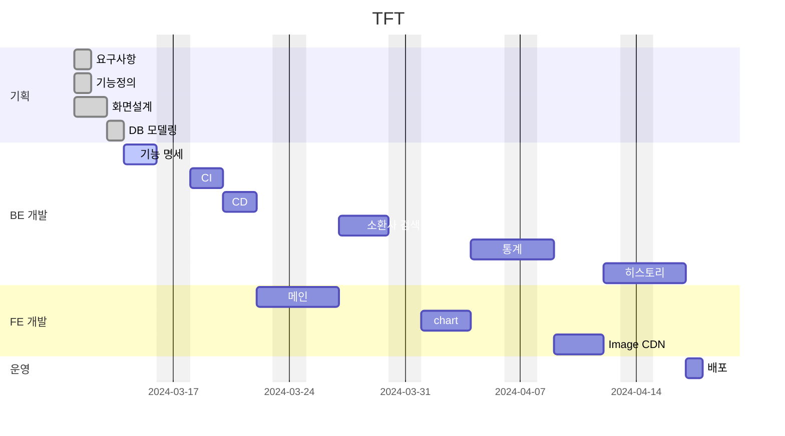

# tft_stats

## 목차

1. [프로젝트 개요](#프로젝트=개요)

   1-1. 설명

   1-2. 개발환경 및 기술

   1-3. 배포
2. [요구 사항](#요구-사항)
<!-- 3. [개발 기간](#개발-기간) -->
4. [기능 정의](#기능-정의)
5. 화면 설계
6. [DB 모델링](#DB-모델링)
7. 기능 명세서
8. 데모 라이브
9. 회고

---

### 프로젝트 개요

Riot Games 게임인 전략적 팀 전투(Team Fight Tactics, TFT)의 랭크게임 데이터를 수집하여

통계 지표를 제공합니다. 객관적인 데이터로 게임 외적인 부분의 상관관계를 표시합니다.

---

<!-- ### 요구 사항

- Riot Games, Discord 소셜 로그인 기능으로 마이페이지를 제공합니다.
- Riot Games 계정과 연동합니다.
- 요일별, 시간대별 게임 전적과 승률을 표시합니다.
- 게임 수에 따른 승률을 표시합니다.

---

### 개발 기간



--- -->

### 기능 정의


| Depth 1     | Depth 2       | Depth 3 | Title       | Description                                             | Features                        |
| ------------- | --------------- | --------- | ------------- | --------------------------------------------------------- | --------------------------------- |
| 메인        |               |         | 소환사 검색 | 소환사를 검색합니다.                                    | Riot Games TFT API              |
| 소환사 통계 |               |         | 통계지표    | 시간별, 요일별 및 연속게임 수에 대한 지표를 제공합니다. | Riot Games TFT API              |
| 마이페이지  | 로그인        |         | 로그인      | 소셜 로그인 기능                                        | Discord, Riot Games 소셜 로그인 |
| 마이페이지  | 소셜 계정연동 |         | 계정 연동   | 로그인 한 계정과 소셜계정을 연동합니다.                 |                                 |
|             |               |         |             |                                                         |                                 |

---

### 화면 설계

---

### 기능 명세서

1. TFT App

headers

```
{ Autorization : bearer {JWT} }
```

Base URL (가제)

```
https://tft.stat
```


| title       | endpoint                       | method | path parameters | query parameters | description |
| ------------- | --------------------------------- | -------- | ----------------- | ------------------ | ------------- |
| 소환사 검색 | summoner/byname/{summoner_name} | GET    | summorner_name  |                  |             |
| 소환사 통계 | stats/{puuid}                   | GET    | puuid           | start , count    |             |
| 로그인      | accounts/login                  | POST   |                 |                  |             |
| 마이페이지  | accounts/mypage                 | GET    |                 |                  |             |

2. Riot Games API

   Headers

```
{ X-Roit-Token : access_key}
```

- match

  match URL

```
https://asia.api.riotgames.com/tft/match/v1/matches/
```


| title                            | endpoint             | method | path parameters | query parameters |
| ---------------------------------- | ---------------------- | -------- | ----------------- | ------------------ |
| get a List of match ids by puuid | by-puuid/{puuid}/ids | GET    | puuid           | start, count     |
| get a match by match id          | {match_id}           | GET    | match_id        |                  |

- summoner

  summoner URL

```
https://kr.api.riotgames.com/tft/summoner/v1/summoners/
```


| title                            | endpoint               | method | path parameters | query parameters |
| ---------------------------------- | ------------------------ | -------- | ----------------- | ------------------ |
| Get a summoner by summoner name. | by-name/{summonerName} | GET    | summoner_name   | start, count     |
| Get a summoner by PUUID          | by-puuid/{puuid}       | GET    | puuid           |                  |
